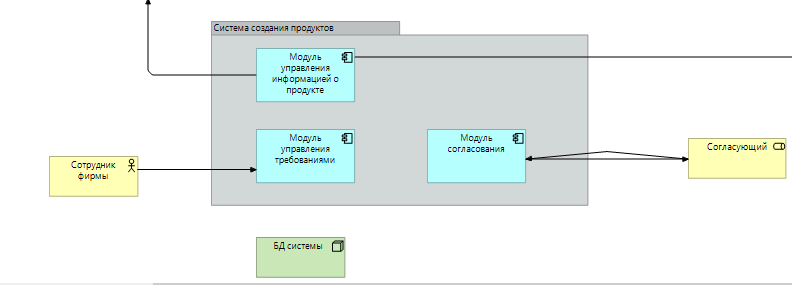

= Сервис "Автоматизированный сбор требований для создания новых продуктов"

== Общий контекст
Текущий процесс организован крайне затруднительно, очень многим сотрудникам сети в целях внедрения нового продукта приходится взаимодействовать лично и часто это занимает огромное количество времени (более 1 месяца, за это время конкуренты успевают внедрить по 6-7 новых продуктов) и артефакты их диалогов и результатов работы постоянно теряются. 
Добавление новых продуктов во все наши системы так же занимает большое количество времени, нередко бывают ошибки при добавлении новых продуктов в разные системы

== Цели внедрения проекта
Многократно ускороить процесс создания и внедрения новых продуктов в сети наших закусочных.

== Описание проекта
В рамках проекта реализуются 2 основные задачи

. Автоматизация сбора требования для создания новых продуктов
. Автоматизация добавления новых продуктов во все системы

На проекте будет использоваться методология waterfall, так как проект нужен целиком, без возможности разделения на отдельные фичи.

Проект декомпозирован на отдельные задачи, управление проектом будет вестить в Jira.
Все задачи проекта можно посмотреть по link:https://neitrin.atlassian.net/jira/software/c/projects/RNNL/boards/3/backlog[ссылке]

=== Автоматизация сбора требования для создания продуктов

Для автоматизации сбора требований реализуются модули "Модуль управления требованиями" и "Модуль согласования"

Общий алгоритм работы:

1) Маркетологи запускают процесс создания нового продукта, в рамках которой назначается технолог.

2) Технолог принимает задачу в свою ответственность.

3) Следующие этапы процесса сбора требований запускаются автоматически, по завершению предыдущего этапа. Этапы сбора требований остаются в текущем виде, но гибко настраиваются

4) После сбора требований запускается процесс согласования нового продукта. Согласование запускается по заранее настроенному шаблону, но может быть скорректировано в любой момент. Доступны как последовательное согласование, так и параллельное.

5) После того, как новый продукт был согласован, информация о новом продукте передается в модуль "Модуль управления информацией о продукте"

=== Автоматизация добавления новых продуктов во все системы

Для автоматизации добавления новых продуктов в системы реализуется модуль "Модуль управления информацией о продукте". Модуль получает информацию о новых продуктах и отправляет ее во все системы.

== Roadmap проекта

Дорожная карта проекта доступна по link:https://app.ganttpro.com/shared/token/8a1e0e693f70991cdfcfcda753922b9e3e1649dfbd8258aef5b25d6adf7b6fb1/1154185#/[ссылке]

_комментарий автора: Диаграмма Ганта была проработана и согласована в бесплатном пробном периоде ПО. Необходимо оплатить, когда проект будет взят в работу_

== Команда проекта

Команда проекта:

* Team Lead системных аналитиков
* Системный аналитик
* Разработчик БД
* BE Разработчик
* FE Разработчик
* Тестировщик

== Риски проекта

Риски первого этапа проекта:

* Недостаточная подготовка персонала к работе с новой системой
* Непредвиденные изменения в требованиях заказчика
* Недостаточное понимание объема работы и сложности задач

Риски второго этапа проекта:

* Проблемы совместимости и интеграции различных технологий в рамках проекта
* Проблемы с передачей и обменом данных между различными системами
* Недостаточная финансовая поддержка и возможность привлечения инвестиций

В рамках проекта была подготовлена отдельная презентация по оценке рисков. Доступна по link:https://docs.google.com/presentation/d/1lFuxP5xo9TFIFKQ9u2vupAhTZEdMODZo/edit?usp=drive_link&ouid=106852021644609553129&rtpof=true&sd=true[ссылке]

== Описание выбранного решения

Новая система будет состоять из 3х модулей:

* Модуль управления требованиями о продукте. Отвечает за сбор требований при создании нового продукта
* Модуль согласования требований о продукте. Отвечает за согласование требований.
* Модуль управления информацией о продукте. Отвечает за доставку информации о новых продуктах в другие системы

== Интеграции проекта

В рамках проекта реализуется интеграция модуля "Модуль управления информацией о продукте" с другими системами:

* Сайты и мобильные приложения

** Название продукта
** Изображение
** Цена
** Состав

* Терминалы самообслуживания

** Название продукта
** Изображение
** Цена
** Состав

* Система управления заказами

** Название продукта
** Технология приготовления

* Система управления производством

** Название продукта
** Технология приготовления

* Система управления складом

** Название продукта
** Ингридиенты

* Система управления логистикой

** Название продукта
** Ингридиенты
** Сроки годности 

* Система управления персоналом

** Название продукта
** Состав продукта
** Способ приготовления

* Система управления клиентским опытом

** Название продукта
** Состав продукта
** Полезные свойства продукта

* Платежные системы

** Название продукта
** Цена

* Аналитика данных

** Название продукта

* Конвейеры и роботы

** Название продукта
** Технология приготовления

* Интеграция с доставками

** Название продукта
** Изображение
** Цена
** Весо-габаритные характеристики

* Маркетинговые решения
** Название продукта
** Уникальные особенности продукта

== Описание архитектуры с НФТ

В связи с решением о применении в организации ISO/IEC 27001 для безопасности данных было принято решение реализовать применение НФТ в сервисе с наиболее чувствительными данными - сервисе "Система управления заказами"

.Нефункциональные требования
[options="header"]
|===
|Требование |Атрибут 
|Доступность 24/7	| Количество пользователей в дневное время - 1000, в ночное - 100
|Минимальное время простоя	| Время восстановление не превышает 3х секунд 
|Быстрый доступ к системе	| Страницы загружаются не более 2х секунд. 
|Быстродействие	|  Выполнение операций длится не более 2х секунд (добавление в корзину, оформление заказа) 
|Отзывчивость системы	| Система моментально откликается на выполненные действия (не более 0,3 секунды) 
|Минимальное время ответа на запрос	|   Среднее время ответа на запрос не превышает 0,5 секунд
|Количество ошибок	|  Количество ошибок не превышает 0,5% от всех выполненных запросов
|Время восстановления после отказа системы	| Время восстановление не превышает 10 минут 
|Защита от сбоев	|  Минимальное количество дней без сбоев = 10.
|Добавление новых точек входа для создания заказов	|  Добавление новых точек входа для создания заказа занимает не более 10и рабочий дней.
|Горизонтальное масштабирование (увеличение мощности при увеличении количества заказов)	|  Система автоматически добавляет ресурсы на сервер при увеличении количества заказов в минуту (увеличение на каждые 500 заказов)
|Противостояние несанкционированному доступу	|  Отсутствует несанкционированный доступ к чувствительным данным
|Целостность данных	|  Система выдерживает ДДОС-атаку до 1 ГБ в секунду
|===

Полная схема сервиса в Archimate доступна по link:https://drive.google.com/file/d/1ib5UAv-VEuXfPdAkgcTHGXKrKhEo7UXP/view?usp=drive_link[ссылке]

== Заключение

Реализация этого проекта позволит многократно сократить время на внедрение новых продуктов сети наших закусочных, что положительно скажется на уровне лояльности наших клиентов, а так же повысит уровень нашей конкурентоспособности, что в итоге приведет к росту выручки.